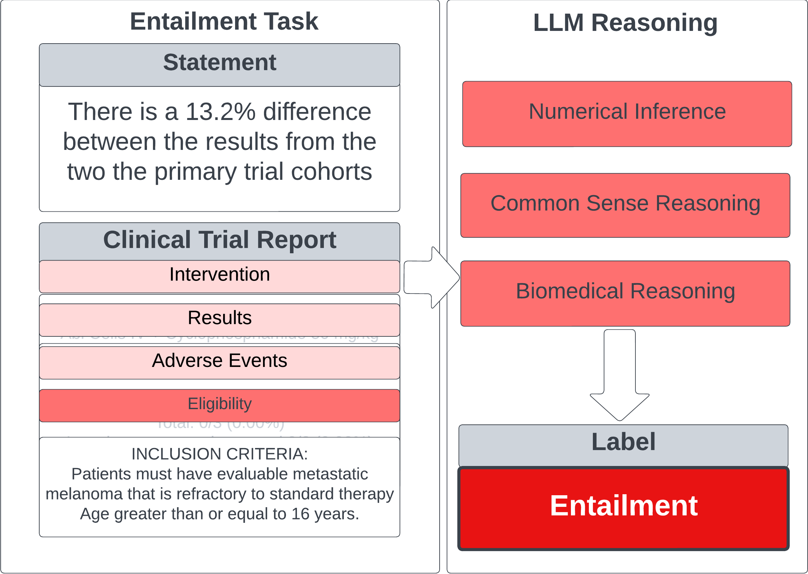
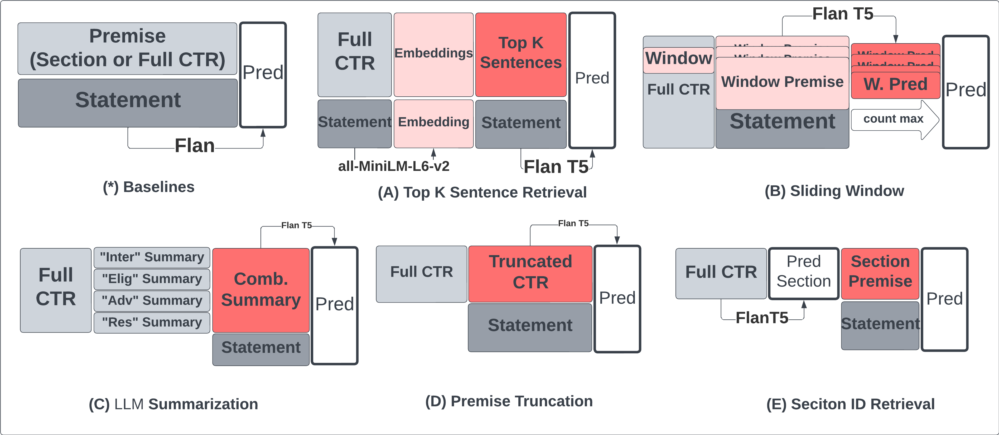
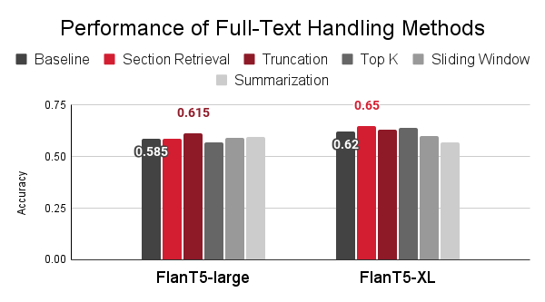
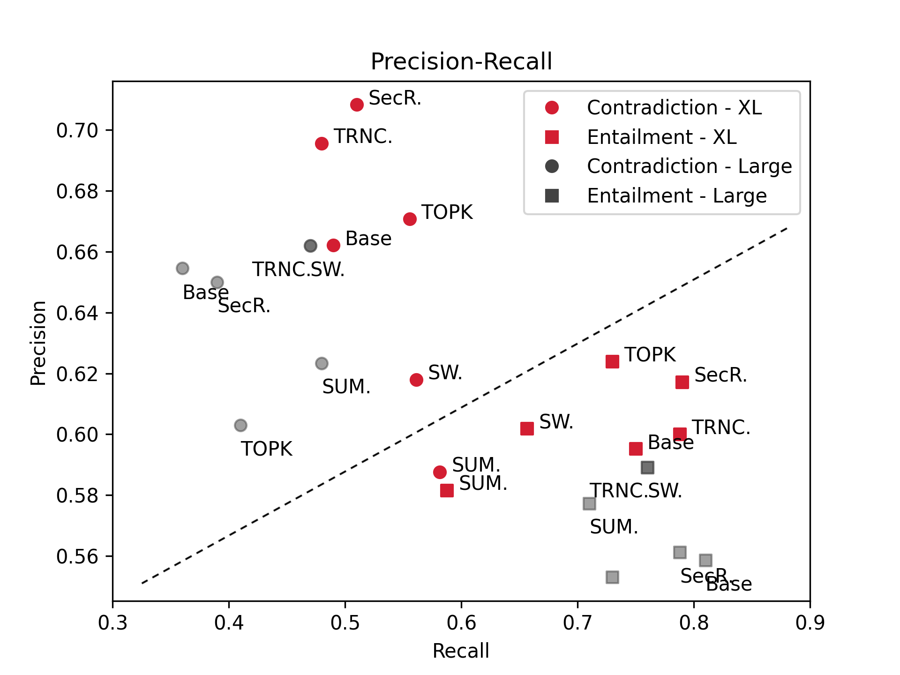

# Full Text Clinical Trial Report Entailment Using LLM Zero-Shot Inference
## Dongxu Huang, Jingwen Che, Wanying Tian
## Simon Fraser University

> A model that uses Large Language Model’s zero-shot inference capability to conduct textual entailment for clinical trial reports. Main contribution is a set of tuned methods that works directly with long, unfiltered full clinical trial reports while maintain comparable performance to models that work with section filtered data.
> Code will be released soon.

## Quick Startup
```Bash
# enter runtime dir
cd code/

# install deps
pip3 install -r requirements.txt

# edit parameters (see Code and Experiment Setup section)
vim main.py

# run
python3 main.py
```
## Introduction 
Clinical Trial Reports (CTR) are important for medical advancement. Every year, there are hundreds of thousands of new reports
are published [5], making a thorough study difficult.

Here, building on top of 2023 NLI4CT challenge Task 7[5], we aim to develop a Natural Language Inference (NLI) model that takes
in a full clinical trial report and makes an entailment inference with a given statement. This task is important
because correct entailment implies logical textual understanding, enabling subsequent tasks such as evidence retrieval or document
classification[5][6].

## Contribution
1. We confirmed that Section ID is an important prior knowledge for clinical CTR entailment given the dataset.
2. We developed a pipeline that could work without Section ID and achieved comparable accuracy.
3. We proposed several different methods to handle the long clinical CTR to work with a limited input token size for LLMs.

## Task Definition
The overall task is defined in Figure 1 with some modifications needed in this work. Specifically, Figure 1 describes the original  2023 task, where one section was filtered out using provided Section ID annotation. Our task is different because we removed Section ID and used full clinical CTR as the premise.

*CTR / Report / Premise:* a trial report is a structured document that contains four sections: intervention, eligibility, adverse events, and results. Each section contains a list of sentences that describe the details of that specific section of the trail. There are usually 10-30 sentences in each section[5]. Each sentence could be 5-50 tokens long[5]. (A token is 4 English characters on average.)

*Statement / Hypothesis:* a statement is a single sentence written by a domain expert and makes a claim about one or two CTRs (premise). If the sample (annotation) is a Single type, the statement makes a claim about one CTR. If the sample is a Comparison type, the statement makes a claim about two CTRs. A statement is usually 19-30 tokens long[5].

*Entailment / Prediction:* the objective of the task is to predict the entailment relation between the hypothesis and the premise. The hypothesis
should either *Entails* or *Contradicts* the premise. Comparing the prediction with the ground truth label helps us understand
the model's capability of performing logical, medical and common sense reasoning on clinical trial reports. 

<div style="display:inline-block;">
    
    <div><text>Figure 1. Task Description (adapted from original paper[5])</text></div>
    <br/>
</div>

## Previous Work
Previous work from the 2023 challenge and other NLI publications focused on two things: short piece NLI for entailment, evidence retrieval and Question-Answer tasks using ML networks and LLMs; complete clinical CTR entailment using provided Section IDs. 

## Methods
Different methods were experimented to handle the long, complete clinical CTR premise. Different parameter sets were tried and only the best results were displayed next.

<div style="display:inline-block;">
    
    <div><text>Figure 2. Methods Overview</text></div>
    <br/>
</div>

## Base Models
**Flan-T5** is chosen as our base inference model. It is chosen for two reasons: 1. It was proven to work well on 
the NLI4CT entailment task compared to other LLMs[6]. 2. It is relatively small (780M parameters for large and 3B 
for XL vs 7 and 11 B for LLaMA). 3. It has been instruction fine-tune to work well with zero-shot inference[3].

**all-MiniLM-L6-v2** is chosen for sentence embedding for one of our methods (Top K). It is a well-known sentence transformer
pre-trained model with fast inference speed and good quality.

## Data

### Source

We used the dev set from the 2023 data at [NLI4CT 2024](https://sites.google.com/view/nli4ct/semeval-2024).

*Data Balance*
The dataset (dev) contains 200 samples and is overall balanced. 

| Type |  | Section |  |  |  | Label |  |
|---|---|---|---|---|---|---|---|
|  | Count | Intervention | Eligibility | Adverse Events | Results | Contradiction | Entailment |
| Single | 140 | 26 | 44 | 32 | 38 | 70 | 70 |
| Comparison | 60 | 10 | 12 | 20 | 18 | 30 | 30 |

## Code 
```
- Root Directory/
  - code/
    - main.py               -- IMPORTANT: executable eval script
    - functions.py          -- IMPORTANT: primary model class and help functions
    - topksearcher.py       -- IMPORTANT: top k search class
    - prepare-topk-embeddings.ipynb  -- IMPORTANT: use this to generate embedding binaries
    - f1-calc.ipynb                  -- Script to calculate precision, recall, F1
    - vectordb/              -- IMPORTANT: location of pre-calculated embedding binaries
      - allMiniLML6V2
        - annotations_db_val.pickle  -- IMPORTANT: embedding binary for all annotation statements
        - raw_text_db.pickle          -- IMPORTANT: embedding binary for all CTR files
    - requirements.txt
```

### Environment Setup
```bash
cd code
pip install -r requirements.txt
```
We recommend using `conda` to create a fresh `python3.11` environement first.

### Run Inference
```bash
python3 main.py
```

Use `prepare-topk-embeddings.ipynb` to build topk embedding binaries first if you want to use topk.

### Choose methods and set up parameters
Please read the comments in `main.py`.

## Preliminary Results
<div style="display:inline-block;">
    
    <div><text>Top Perming Methods on Full CTR Text</text></div>
    <br/>
</div>

<div style="display:inline-block;">
    
    <div><text>Precision&Recall for Methods</text></div>
    <br/>
</div>

## Future Work

1. Continuous Improvement of Accuracy Through Hyperparameter Tuning
2. Evidence Retrieval After Entailment Prediction
3. Model Explanaibility

## Reference
[1] Nancy E. Avis, Kevin W. Smith, Carol L. Link, Gabriel N. Hortobagyi, and Edgardo Rivera.
Factors associated with participation in breast cancer treatment clinical trials. Journal of
Clinical Oncology, 24(12):1860–1867, apr 2006.

[2] Samuel R. Bowman, Gabor Angeli, Christopher Potts, and Christopher D. Manning. A large
annotated corpus for learning natural language inference. InProceedings of the 2015 Confer-
ence on Empirical Methods in Natural Language Processing. Association for Computational
Linguistics, 2015.

[3] Hyung Won Chung, Le Hou, Shayne Longpre, Barret Zoph, Yi Tay, William Fedus, Yunxuan
Li, Xuezhi Wang, Mostafa Dehghani, Siddhartha Brahma, Albert Webson, Shixiang Shane Gu,
Zhuyun Dai, Mirac Suzgun, Xinyun Chen, Aakanksha Chowdhery, Alex Castro-Ros, Marie
Pellat, Kevin Robinson, Dasha Valter, Sharan Narang, Gaurav Mishra, Adams Yu, Vincent
Zhao, Yanping Huang, Andrew Dai, Hongkun Yu, Slav Petrov, Ed H. Chi, Jeff Dean, Jacob
Devlin, Adam Roberts, Denny Zhou, Quoc V. Le, and Jason Wei. Scaling instruction-finetuned
language models, 2022.

[4] Jay DeYoung, Eric Lehman, Benjamin Nye, Iain Marshall, and Byron C. Wallace. Evidence
inference 2.0: More data, better models. InProceedings of the 19th SIGBioMed Workshop on
Biomedical Language Processing. Association for Computational Linguistics, 2020.

[5] Maël Jullien, Marco Valentino, Hannah Frost, Paul O’regan, Donal Landers, and André Freitas.
SemEval-2023 task 7: Multi-evidence natural language inference for clinical trial data. In
Proceedings of the The 17th International Workshop on Semantic Evaluation (SemEval-2023).
Association for Computational Linguistics, 2023.

[6] Kamal Raj Kanakarajan and Malaikannan Sankarasubbu. Saama AI research at SemEval-
2023 task 7: Exploring the capabilities of flan-t5 for multi-evidence natural language inference
in clinical trial data. InProceedings of the The 17th International Workshop on Semantic
Evaluation (SemEval-2023). Association for Computational Linguistics, 2023.

[7] Jiongnan Liu, Jiajie Jin, Zihan Wang, Jiehan Cheng, Zhicheng Dou, and Ji-Rong Wen. Reta-
llm: A retrieval-augmented large language model toolkit, 2023.

[8] Keivalya Pandya and Mehfuza Holia. Automating customer service using langchain: Building
custom open-source gpt chatbot for organizations, 2023.

[9] Yuxuan Zhou, Ziyu Jin, Meiwei Li, Miao Li, Xien Liu, Xinxin You, and Ji Wu. THiFLY
research at SemEval-2023 task 7: A multi-granularity system for CTR-based textual entailment
and evidence retrieval. InProceedings of the The 17th International Workshop on Semantic
Evaluation (SemEval-2023). Association for Computational Linguistics, 2023.

[10] Yun Luo and Zhen Yang and Fandong Meng and Yafu Li and Jie Zhou and Yue Zhang. An Empirical Study of 
Catastrophic Forgetting in Large Language Models During Continual Fine-tuning. arXiv preprint arXiv:2308.08747, 2023.
